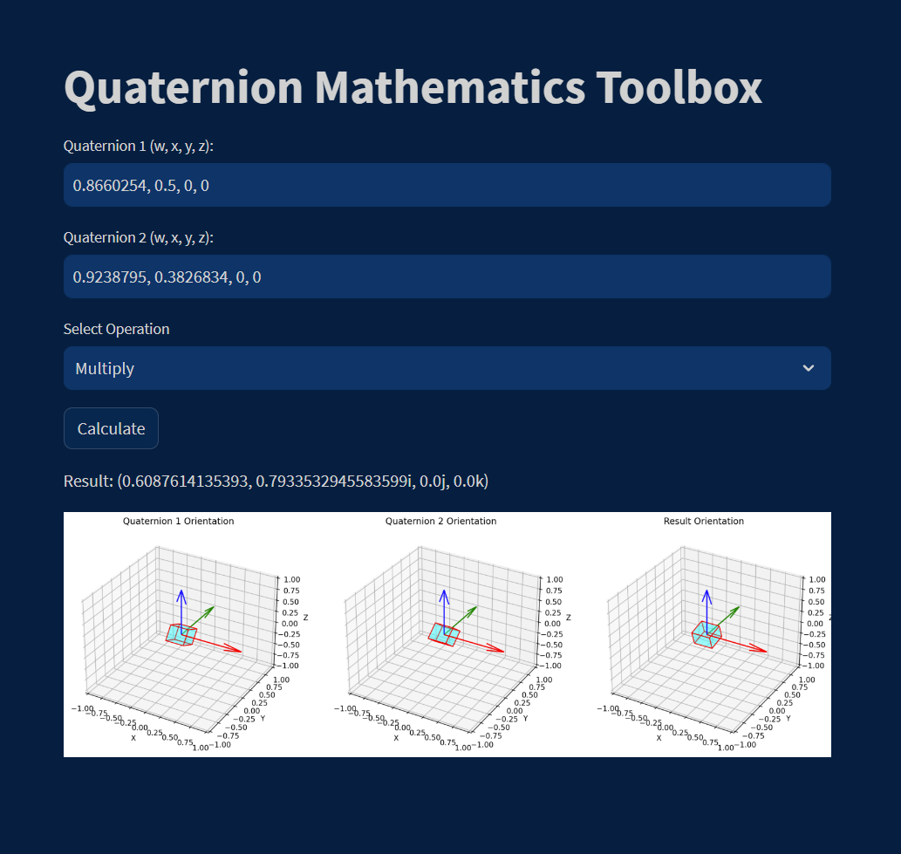

# Quaternion Mathematics Toolbox

Quaternion Mathematics Toolbox is an interactive web application developed with Streamlit, designed to simplify quaternion operations and provide a visual representation of their orientations. Quaternions are powerful mathematical entities used in 3D rotations and computer graphics.

 <!-- Consider adding a screenshot of your app for better illustration. -->

## Features
- User-friendly interface to input two quaternions.
- Supports quaternion operations like Add, Subtract, and Multiply.
- Visual representation of quaternion orientations in 3D space.
- Immediate feedback and error handling for invalid quaternion values.

## Installation & Usage

1. **Clone the Repository**
    ```bash
    git clone https://github.com/HeshamFS/QuatViz.git
    ```

2. **Navigate to Directory**
    ```bash
    cd QuatViz
    ```

3. **Install the Required Libraries**
    ```bash
    pip install -r requirements.txt
    ```

4. **Run the Streamlit App**
    ```bash
    streamlit run quatviz_app.py
    ```

## Contribute

We welcome contributions! Please fork the repository and make changes as you'd like. Pull requests are warmly welcome.

## License

This project is open-source and available under the MIT License.

## Acknowledgments

- [Streamlit](https://streamlit.io/) for their intuitive web app framework.

